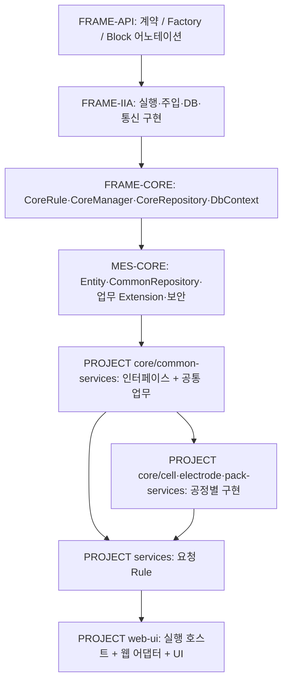

# 2nd-battery · Project Architecture

본문은 2026-09-09 원본 검토 문서의 관찰을 기반으로 한다. pull 이후 D:/thira/package/2nd의 core 4개 서비스 모듈·services·web-ui를 확보해 참조 경로와 대표 호출·POM을 재확인했다. 전체 구현·실행 결과를 다시 검증한 것은 아니며 상세 재확인 범위와 경로 약칭은 [탐색 지도](source-navigation-map.md)를 따른다.

분류 A=Project-specific, B=조건부 Reusable C-MOS Project Pattern.
검증: 현재 프로젝트 소스/설정 정적 확인. 인접 Framework/MES-Core는 별도 checkout이며 실제 resolved JAR 동일성은 확인하지 않음.

## 핵심 구조

이 소스는 하나의 고객 업무 애플리케이션만으로 해석하면 탐색을 잘못 시작한다. 웹 호스트, 요청 Rule, 2차전지 공통 업무와 공정별 서비스 블록이 나뉘어 있다. **디렉터리 `core`는 FRAME-CORE도 MES-CORE도 아니다. PROJECT 내부의 배터리 서비스 계층**이다. [A / POM·전체 선언 확인]

| 경계 | 실제 역할 | 먼저 확인할 근거 |
|---|---|---|
| `web-ui` | Factory 기동, 웹 설정, 로그인/파일 어댑터, 배포 UI | web-ui/pom.xml (`B/web-ui/pom.xml:1`), WebServer (`B-WEB/WebServer.java:5`), web.json (`B-RES/config/web.json:29`) |
| `services` | UI/설비/MCS 요청의 CoreRule, 요청값 변환과 Manager 호출; SQL 보관본 | services/pom.xml (`B/services/pom.xml:1`), TrackInLot_Assembly (`B-RULE/cell/production/assembly/TrackInLot_Assembly.java:43`) |
| `core/common-services` | 모든 공정의 Manager 인터페이스 + common 업무 구현 | core/common-services/pom.xml (`B/core/common-services/pom.xml:1`), IRECIPEITEMManager (`B-COMMON/interfaces/common/masterdata/IRECIPEITEMManager.java:9`), PRODUCTIONLotManager · common/production (`B-COMMON/service/common/production/PRODUCTIONLotManager.java:1877`) |
| `core/cell-services` | assembly/formation 및 formation logic 구현 | PRODUCTIONLotManager · cell/production/assembly (`B-CELL/service/cell/production/assembly/PRODUCTIONLotManager.java:73`), PRODUCTIONLotManager · cell/production/formation (`B-CELL/service/cell/production/formation/PRODUCTIONLotManager.java:22`) |
| `core/electrode-services` | mixing/plate, MCS, MCS 기준정보 구현 | PRODUCTIONLotManager · electrode/production/mixing (`B-ELECTRODE/service/electrode/production/mixing/PRODUCTIONLotManager.java:40`), MCSManager · electrode/mcs (`B-ELECTRODE/service/electrode/mcs/MCSManager.java:1921`) |
| `core/pack-services` | modules/packing, 포장 logic, 출하/납품 구현 | PRODUCTIONPackingManager · pack/production/logic (`B-PACK/service/pack/production/logic/PRODUCTIONPackingManager.java:120`), DELIVERYORDERManager · pack/plan (`B-PACK/service/pack/plan/DELIVERYORDERManager.java:229`) |

`common-services`를 “인터페이스만 있는 모듈”로 가정하면 안 된다. services POM 주석은 그렇게 읽힐 수 있으나 실제 common Manager 구현도 들어 있다.

## Framework → Project 소비 구조

화살표는 기반 제공 → 소비 관계다. 실제 런타임 요청 호출 방향은 [runtime-and-business-flow.md](runtime-and-business-flow.md)에 별도로 정리했다. 웹 호스트는 추가로 `plugin-web-starter`를 직접 의존한다. Spring MVC/DI로 해석할 근거는 이 프로젝트의 POM/선언에 없다.

- **FRAME-API 소비:** `Factory.initialize`, `@AutoInjection`, `@BlockController`, `@BlockModule`, Manager 인터페이스 계약.
- **FRAME-IIA 소비:** String/Collection 등의 utility 및 Framework 주입·Context·Connector 구현을 이용한다.
- **FRAME-CORE 소비:** Rule/Manager 직접 상속, `getDbContext()`, `setCommonData`, `getWebdataList`, `setDatadic`, `RequestType`.
- **MES-CORE 소비:** `Recipeitem`, `Lot`, `Batch`, `Inspreq` 등 업무 Entity; `CommonRepository`와 `MasterData/Production/Plan/Material/Quality Extension`; IdPattern, OptionSet, 상태/오류 상수, 인증 구현.
- **PROJECT 추가:** 공정별 인터페이스/Manager 블록, 공정 정책/업무 순서, 메시지 하위 목록 바인딩, 화면별 SQL/응답 이름, 웹 로그인/파일 어댑터.

패키지명이 `com.thirautech.cmos.mes.core`라고 해서 모두 FRAME-CORE가 아니다. `CoreRule/DbContext`는 cmos-frame, `CommonRepository/Recipeitem/ProductionExtension`는 mes-core 소스에 있다. 저장소 경계로 소유권을 확인한다. CommonRepository (`M-CORE/common/business/CommonRepository.java:13`) CoreRule (`F-CORE/abstracts/business/CoreRule.java:188`)

## 공통 계층은 상속보다 위임으로 연결된다

`TrackInLot_Assembly → interfaces.cell.production.assembly.IPRODUCTIONLotManager → service.cell.production.assembly.PRODUCTIONLotManager → interfaces.common.production.IPRODUCTIONLotManager → service.common.production.PRODUCTIONLotManager`.

공정별 Manager는 공통 `PRODUCTIONLotManager`의 subclass가 아니라 **CoreManager를 직접 상속하는 별도 구현체**다. assembly·formation·mixing에서 반복 확인했다. 동일한 단순 클래스명/인터페이스명이 여러 패키지에 있으므로 import/FQCN을 따라가야 한다. [B / 이 블록 구조를 채택한 프로젝트에 적용] PRODUCTIONLotManager · cell/production/assembly (`B-CELL/service/cell/production/assembly/PRODUCTIONLotManager.java:73`) PRODUCTIONLotManager · cell/production/formation (`B-CELL/service/cell/production/formation/PRODUCTIONLotManager.java:22`) PRODUCTIONLotManager · electrode/production/mixing (`B-ELECTRODE/service/electrode/production/mixing/PRODUCTIONLotManager.java:40`)

## 재사용/확장 위치

| 요구 | 프로젝트에서 보인 확장 방식 | 그대로 복사하지 않을 부분 |
|---|---|---|
| 공정별 작업 | 공정 인터페이스/Manager에서 공통 업무로 위임 | 공정명, 인자 구성, Lot/Carrier 처리 차이 |
| 공통 업무 수정 | common-services Manager에서 MES-Core Extension 조합 | 다른 공정 모두에 미치는 영향 |
| 기준정보 저장 | CoreRule에서 입력 해석 → Manager에서 행 상태 CUD | `_ROW_STATE`, 삭제 정책, site 포함 복합키 |
| 기존 Core 업무 사용 | CommonRepository Extension이나 MES-Core Implement를 호출 | 이력을 포함한 부수효과를 일반 UPDATE로 치환하지 않음 |
| 웹 파일 처리 | CoreRule 기반 로컬 BaseHttpController 확장 | 활성 webMapping의 대상은 별도 확인 |

프로젝트 전체에 강제되는 별도 BaseRule/BaseManager는 발견되지 않았다. 로컬 BaseController/BaseHttpController는 웹 어댑터 계열에 국한된다. 업무용 Entity/Repository 자체 구현은 주류가 아니다. 로컬 CoreRepository subclass 3개는 모두 sample이며, `TestEntity`를 생산 Entity 표준으로 취급하면 안 된다.

## 빌드 소스와 배포 의존성의 경계 [A]

- core 및 4개 child POM: **3.5.2, Java source/target 17**. child는 aggregator를 parent로 선언하지 않고 각 POM이 설정을 가진다.
- services/web-ui: **3.5.1, Java source/target 11**. services는 배터리 모듈 3.5.1을 명시한다.
- web-ui는 services와 web-starter를 의존한다. 상위 작업 폴더에 이 셋을 묶는 통합 POM은 없다.
- 인접 `cmos-frame`, `mes-core/core`의 현재 POM은 **3.5.3-SNAPSHOT**. Framework Memory의 3.5.x 설명과 연결 심볼을 대조했지만 해당 checkout이 배포 JAR과 같다고 증명하지 않았다.

따라서 `core`를 수정·빌드하면 `services/web-ui`가 곧바로 그 결과를 쓴다는 가정은 금지한다. 버전/실제 resolved artifact와 JDK를 먼저 맞춰 확인해야 한다. 이번 작업에서 POM은 변경하지 않았다. core/pom.xml (`B/core/pom.xml:1`) core/common-services/pom.xml (`B/core/common-services/pom.xml:1`) services/pom.xml (`B/services/pom.xml:1`) web-ui/pom.xml (`B/web-ui/pom.xml:1`)

Framework 자체 설명은 [Framework Memory · architecture.md](../cmos-frame/architecture.md), [Framework Memory · extension-contracts-and-invariants.md](../cmos-frame/extension-contracts-and-invariants.md)로 연결하고 복제하지 않는다. 특히 Factory의 단일 구현체 제한을 이 프로젝트의 Block 선택 계약으로 확대하지 않는다. [extension-patterns-and-invariants.md](extension-patterns-and-invariants.md)

## Verification

원본 근거: `B/.scratch/knowledge-map-review/project-architecture.md` (2026-09-09). 원본 문서의 정적 검사 PASS는 실제 배포 JAR·설정·DB·HTTP·브로커·동시성 검증이 아니다. medium confidence와 project 범위를 유지한다. 다른 프로젝트에 적용하려면 같은 호출·설정 계약을 먼저 대조한다.
