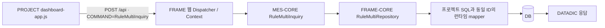
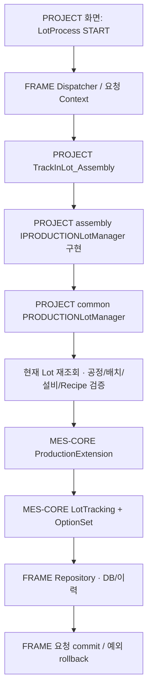

# 2nd-battery · Runtime & Business Flow

본문은 2026-09-09 원본 검토 문서의 관찰을 기반으로 한다. pull 이후 D:/thira/package/2nd의 core 4개 서비스 모듈·services·web-ui를 확보해 참조 경로와 대표 호출·POM을 재확인했다. 전체 구현·실행 결과를 다시 검증한 것은 아니며 상세 재확인 범위와 경로 약칭은 [탐색 지도](source-navigation-map.md)를 따른다.

여기서 “흐름 확인”은 현재 소스 호출 연결의 정적 추적이다. HTTP 호출/서버 기동/DB commit 결과는 검증하지 않았다. 로컬 모듈 간 POM 버전 차이는 [project-architecture.md](project-architecture.md) 참조.

## 요청이 연결되는 위치

프로젝트 시작점 WebServer (`B-WEB/WebServer.java:5`)는 `Factory.initialize(args)`만 호출한다. `web.json`은 `MesWebDispatcher`, MES-Core 보안 필터, API/web 매핑을 선택하고 `cmos.json`은 공통 Dispatcher/Processor를 지정한다. Dispatcher 내부 lifecycle은 [Framework Memory · runtime-lifecycle.md](../cmos-frame/runtime-lifecycle.md)를 재사용한다. 프로젝트는 주로 **CoreRule.messageValidation/process** 및 그 안에서 호출되는 Manager에 업무를 붙인다.

`Controller`라는 파일명이 HTTP MVC Controller를 뜻하지 않는다. `LoginController`는 CoreRule이며, 로컬 `BaseController`도 CoreRule이다. `CoreController + @EventMethodMapping`의 로컬 예는 TesterController (`B-WEB/test/TesterController.java:7`)에 있으나 test 목적의 로그 메서드라 생산 Controller 표본으로 추천하지 않는다.

## READ 1 · 공통 RuleMultiInquiry 활용 [B]

**표본:** dashboard-app.js (`B-RES/wwwroot/mes/dashboard-app.js:119`) + SelectRealTimeEquipmentState_THiRAMES.Service.UI_00001_sql.xml (`B-SQL/mssql/storedquery/SelectRealTimeEquipmentState_THiRAMES.Service.UI_00001_sql.xml:4`). 별도 조회 Rule/Manager를 만들지 않고 MES-Core 조회 기능을 쓰는 실제 UI 요청을 보여 준다.

- UI가 COMMAND, SITEID, USERID, APPLICATIONID, LANGUAGE, WEBDATA의 CLASSID/QUERYID/VERSION과 검색 조건을 만든다. 대표 QUERYID는 `SelectRealTimeEquipmentState`, VERSION은 `00001`이다.
- RuleMultiInquiry (`M-CORE/common/business/rulemultiinquiry/RuleMultiInquiry.java:9`)는 공통 Repository를 선택하며 프로젝트 Manager를 통과하지 않는다. AbstractRuleMultiRepository (`F-CORE/common/business/rulemultiinquiry/AbstractRuleMultiRepository.java:35`)는 statement 후보를 해석하고 조건 Map을 전달한다.
- 프로젝트 보관 SQL의 namespace/id는 `com.thirautech.cmos.mes.SelectRealTimeEquipmentState-00001`. 단순 파일명이 mapper ID는 아니다.
- **재사용:** 단순 화면 조회라면 이 경로를 먼저 검토한다. query ID/입력 조건/응답 데이터 이름/권한 범위를 함께 맞춘다.
- **복사 금지:** dashboard의 설비/배치 join·PLANTID 정책. 이 SQL의 Batch join은 SITEID를 함께 묶지 않으므로 다른 프로젝트에서 site 분리 표준이라고 일반화하지 않는다.
- **실행 한계:** 프로젝트 XML은 sql-back에 있으므로 도식의 SQL 단계는 “해당 ID의 mapper가 실제 로딩된 경우”다. 이 보관본이 실제 실행됐다는 증거는 없다.

## READ 2 · Manager에서 조회·가공 [B, 조건부 표본]

**표본:** SelectProductOrderListForWo (`B-RULE/common/plan/SelectProductOrderListForWo.java:14`) → WORKORDERManager · common/plan (`B-COMMON/service/common/plan/WORKORDERManager.java:1616`) → SelectProductOrderListForWo_THiRAMES.Service.Biz_00001_sql.xml (`B-SQL/mssql/storedquery/SelectProductOrderListForWo_THiRAMES.Service.Biz_00001_sql.xml:4`) / SelectProductOrderListForWo_THiRAMES.Service.Biz_00001_sql.xml (`B-SQL/postgresql/mes/storedquery/SelectProductOrderListForWo_THiRAMES.Service.Biz_00001_sql.xml:4`).

`/api COMMAND=SelectProductOrderListForWo → FRAME Dispatcher → PROJECT Rule → IWORKORDERManager → PROJECT WORKORDERManager.selectProductOrderListForWo → FRAME DbContext.selectList → MyBatis/DB → PivotUtility → Rule.setDatadic("SelectProductOrderListForWo", 0, dt) → 응답`.

Rule은 WEBDATA별 날짜/제품/지시 조건을 꺼낸다. Manager는 날짜를 문자열로 정리하고 DATEDIFF를 계산하여 고정 statement `com.thirautech.cmos.mes.SelectProductOrderListForWo-00001`를 호출한다. SQL은 지시/일자 계획을 행으로 만들고, Manager는 마지막 두 컬럼 `PLANDATE/PLANQTY`를 pivot 축/값으로 사용한다.

- **선정 이유:** Rule의 요청 파싱, Manager의 업무 가공, XML 조회, DATADIC 반환을 한 번에 추적할 수 있다.
- **재사용:** 조회 전후의 업무 가공이 필요할 때 이 책임 분리를 참고한다.
- **조건:** SQL 컬럼 순서와 alias, 단일 데이터셋 반환 이름을 함께 수정한다. Manager는 `dt != null`만 확인 후 `dt.get(0)`을 사용하므로 빈 조회 결과 안전성을 보장하는 표본은 아니다. 여러 WEBDATA를 순회해도 응답 키/인덱스는 고정이므로 다중 데이터셋 확장 시 계약 확인이 필요하다.
- **현재 불일치:** Manager는 WORKORDERTYPE 조건을 넣으나 보관 SQL은 PRODUCTORDERTYPE을 읽는다. 이 경로는 구조 표본으로 채택하되, 조건 이름/0건/날짜 경계 검증 후 사용해야 한다.

## SAVE · 기준정보 행 상태별 CUD [B, 조건부 표본]

**표본:** SaveRecipeItem (`B-RULE/common/masterdata/SaveRecipeItem.java:13`) → IRECIPEITEMManager (`B-COMMON/interfaces/common/masterdata/IRECIPEITEMManager.java:9`) → RECIPEITEMManager · common/masterdata (`B-COMMON/service/common/masterdata/RECIPEITEMManager.java:61`).

`요청 → FRAME Dispatcher → SaveRecipeItem.messageValidation → process → IRECIPEITEMManager.save → RECIPEITEMManager.create/update/delete → MES CommonRepository → FRAME CoreRepository/JPA → DB/Hist → FRAME 요청 commit`.

1. Rule은 `_ROW_STATE, SITEID, RECIPEITEMID, RECIPEITEMNAME` 키를 검사한다. process에서는 Entity 변환, 값 필수 검사와 ISDCOL/ISSETUP/ISSQC의 기본 N을 설정한다.
2. Manager.save는 ADD → UPDATE → DEL 그룹 순으로 처리한다. 입력 배열 순서대로 서로 다른 작업을 실행하는 계약이 아니다.
3. create는 RECIPEITEMID+SITEID로 기존 행을 확인한다. 기존 행은 update, 신규는 common-data를 설정하여 목록 create(..., true)로 보낸다.
4. update는 존재 검사 후 상태에 따라 DELETE/UNDELETE/UPDATE. delete는 RequestType.DELETE로 논리 삭제한다.
5. 정상 요청의 transaction 완료는 Framework에 맡긴다. 이 Rule/Manager에는 직접 commit이 없다.

선정 이유는 “짧고 모든 코드가 안전해서”가 아니라 실제로 반복되는 책임 분리와 공통 CUD 사용을 가장 쉽게 볼 수 있기 때문이다. **update의 삭제 분기 `break`는 후속 행 처리를 종료한다.** 이를 복사하지 말고 [extension-patterns-and-invariants.md](extension-patterns-and-invariants.md)의 검증 항목을 적용한다. bool=true는 commit 플래그가 아니라 해당 CUD overload의 이력 정책이다.

## 업무 Event · Assembly Track-In [B 구조, A 정책]

**표본:** TrackInLot_Assembly (`B-RULE/cell/production/assembly/TrackInLot_Assembly.java:43`) → PRODUCTIONLotManager · cell/production/assembly (`B-CELL/service/cell/production/assembly/PRODUCTIONLotManager.java:73`) → PRODUCTIONLotManager · common/production (`B-COMMON/service/common/production/PRODUCTIONLotManager.java:1877`) → PRODUCTIONLotManager · common/production (`B-COMMON/service/common/production/PRODUCTIONLotManager.java:2798`) → ProductionExtension (`M-CORE/common/business/extension/ProductionExtension.java:849`).

UI 증거: PM_CL_002-NJaZFJa6.js.map (`B-RES/wwwroot/assets/PM_CL_002-NJaZFJa6.js.map:1`)의 `sourcesContent` 내 `src/pages/mes/PM/PM_CL_002.vue`, `LotProcess` 약 1657행. START는 `DATALIST: {LOTLIST:[{LOTID:...}]}`를 만들고 `TrackInLot_Assembly`를 선택한다. 이는 source map 안의 원본 내용이며 현재 폴더에 유지보수용 Vue 원본이 있는 것은 아니다.

프로젝트 Rule은 WEBDATA 첫 Equipment를 header로 삼아 **DATALIST.LOTLIST**를 Lot으로 바꾸고 SITEID/EQUIPMENTID를 내려 준다. 공정 Manager는 common Manager로 위임한다. common Manager는 DB 현재 Lot을 재조회한 뒤 다음을 검증/처리한다.

- 같은 PROCESSNODEID, WAITFORRULE 처리 상태, 허용 Lot 상태, 설비-공정 관계. PRODUCTIONLotManager · common/production (`B-COMMON/service/common/production/PRODUCTIONLotManager.java:1997`)
- 첫 Lot의 Batch가 FINISHED가 아니고, 설비 BATCHID와 일치할 것. Recipe가 있으면 공정 유형별 Recipe 검증/갱신.
- Recipe 기반 SQC 생성 후 실제 Track-In 수행. 최초 CREATED Lot이면 startLot 후 재조회, 이후 설비/Recipe와 공통 추적값을 설정한다.
- MES-Core ProductionExtension은 tracking history/worktime 옵션을 설정해 LotTracking으로 넘긴다. 행 상태만 직접 UPDATE하면 같은 업무 효과를 보장하지 않는다.

**복사 제한:** 첫 원소를 기준으로 Batch/Site/상태 분기를 하므로 동질적인 목록 전제가 있다. 같은 node 검사는 확인했으나 혼합 Site/Batch/CREATED·ACTIVE 목록 전체를 모두 거부한다는 보장은 없다. UI 단일 header 계약을 batch API로 넓힐 때 추가 검증해야 한다.

## 전체 교체 SAVE · BOM [A 의미, B 패턴]

SaveBom (`B-RULE/common/masterdata/SaveBom.java:13`) → BOMManager · common/masterdata (`B-COMMON/service/common/masterdata/BOMManager.java:60`)는 DEL 제외 → 중복검사 → **첫 행의 Product/Site 기존 BOM 전체 물리 삭제** → 남은 행 ID 재생성 → 전체 INSERT 순서다. UI BOM-aAsZ1en0.js.map (`B-RES/wwwroot/assets/BOM-aAsZ1en0.js.map:1`)의 source map 안 `BOM.vue:paramData2Helper`는 `getGridData()` 전체를 사용하며 삭제행 표시를 포함해 전달한다.

일반 dirty-row 저장의 표본으로 사용하면 안 된다. 전체 목록 교체 의미, 단일 Product/Site, BOMID 재생성, 이력 포함 영향행 수 검사를 함께 참고한다. 빈 목록은 이 Rule에서 return하므로 “빈 리스트 전송=전체 삭제”도 성립하지 않는다.

## 품질 업무의 연쇄 갱신 [A]

RequestInspection (`B-RULE/common/quality/RequestInspection.java:15`)는 이름이 일반적이어도 현재 switch에서 IQC만 호출한다. QUALITYManager · common/quality (`B-COMMON/service/common/quality/QUALITYManager.java:110`)는 활성 검사정의 확인 → 자재/기존 검사 확인 → Inspreq/Inspreqlot 생성 → 구매 품목 검사 상태 → MATERIALManagerQuality · common/material (`B-COMMON/service/common/material/MATERIALManagerQuality.java:24`)의 IQC 관련 자재 처리를 연결한다. “검사요청 테이블만 저장”으로 축소하면 주변 정합성을 놓친다.

QUALITYManager · common/quality (`B-COMMON/service/common/quality/QUALITYManager.java:10538`)의 현재 저장 순서는 **Inspreqlot 목록 → Inspreq**다. Header-first 일반론으로 문서를 바꾸지 않는다. 해당 순서가 가능한 DB 제약/실제 성공 여부는 미검증이다.

설비/MCS와 파일/인증의 별도 완료 경계는 [integration-and-web-boundaries.md](integration-and-web-boundaries.md) 참조. 중요한 흐름마다 정적 연결과 runtime 성공을 구분한다.

## Verification

원본 근거: `B/.scratch/knowledge-map-review/runtime-and-business-flow.md` (2026-09-09). 원본 문서의 정적 검사 PASS는 실제 배포 JAR·설정·DB·HTTP·브로커·동시성 검증이 아니다. medium confidence와 project 범위를 유지한다. 다른 프로젝트에 적용하려면 같은 호출·설정 계약을 먼저 대조한다.
